# DevOps-lab3
Для начала работы в GitHub в разделе `GitHub Actions` был создан воркфлоу `badwf.yml`. 

Для этого необходимо было выполнить следующие действия, а именно:
1) Кликнуть на кнопочку `new workflow`;
   
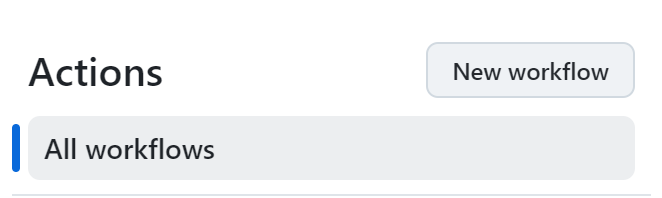

2) Выбрать "создать свой воркфлоу самостоятельно".
   
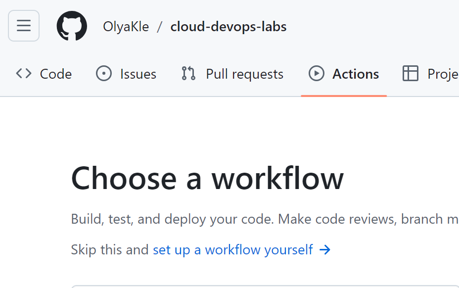

## Задание 1
> Написать “плохой” CI/CD файл, который работает, но в нем есть не менее пяти “bad practices” по написанию CI/CD.

При выполнении задания в GitHub в разделе `GitHub Actions` был создан воркфлоу `badwf.yml`. На следующих картинках видно, что он был собран и запущен успешно.

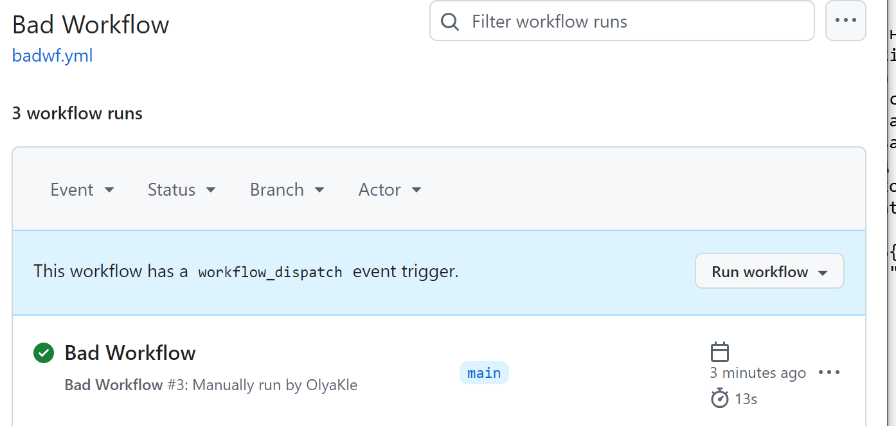

А кликнув на три точки справа от созданного файла, можно выбрать из выпадающего меню пункт `view workflow file` и посмотреть код данного воркфлоу.

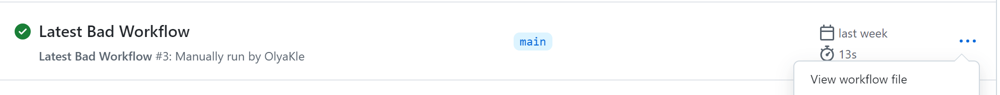
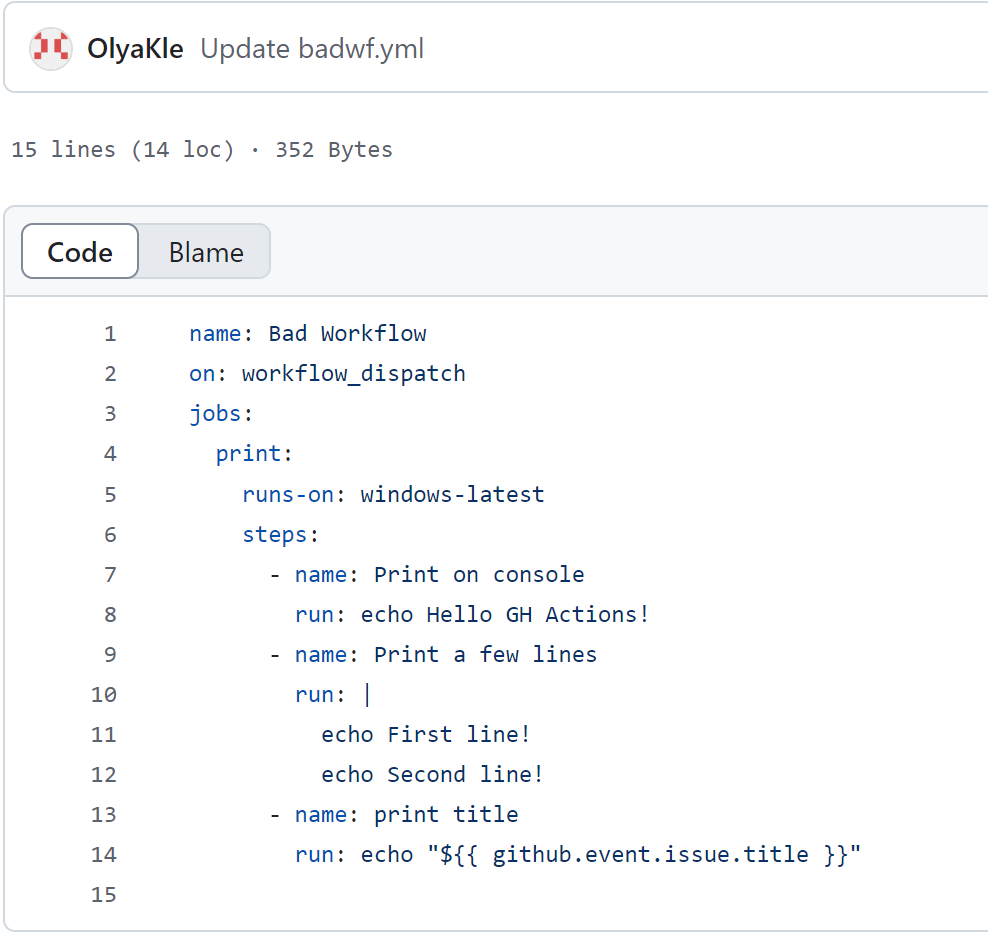

Если вернуться обратно и кликнуть на кнопку `print` можно увидеть как работал файл.

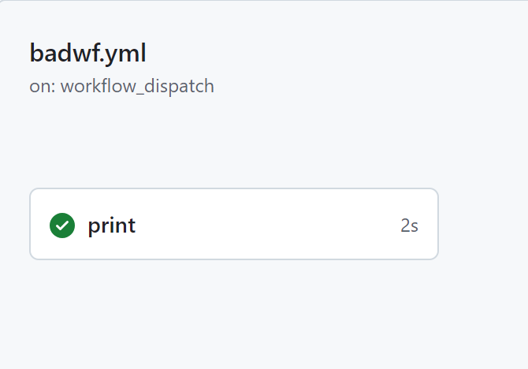
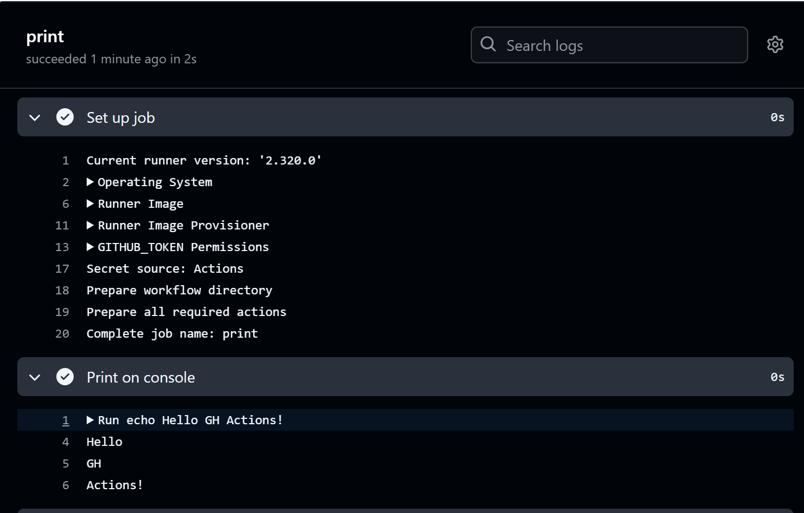
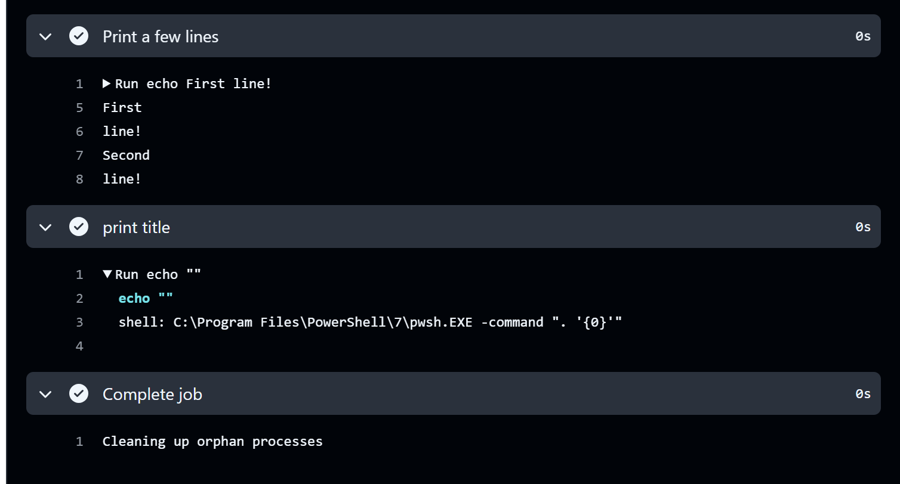

Также воркфлоу был надстроен над .py файлом, в результате чего код стал выглядеть так:

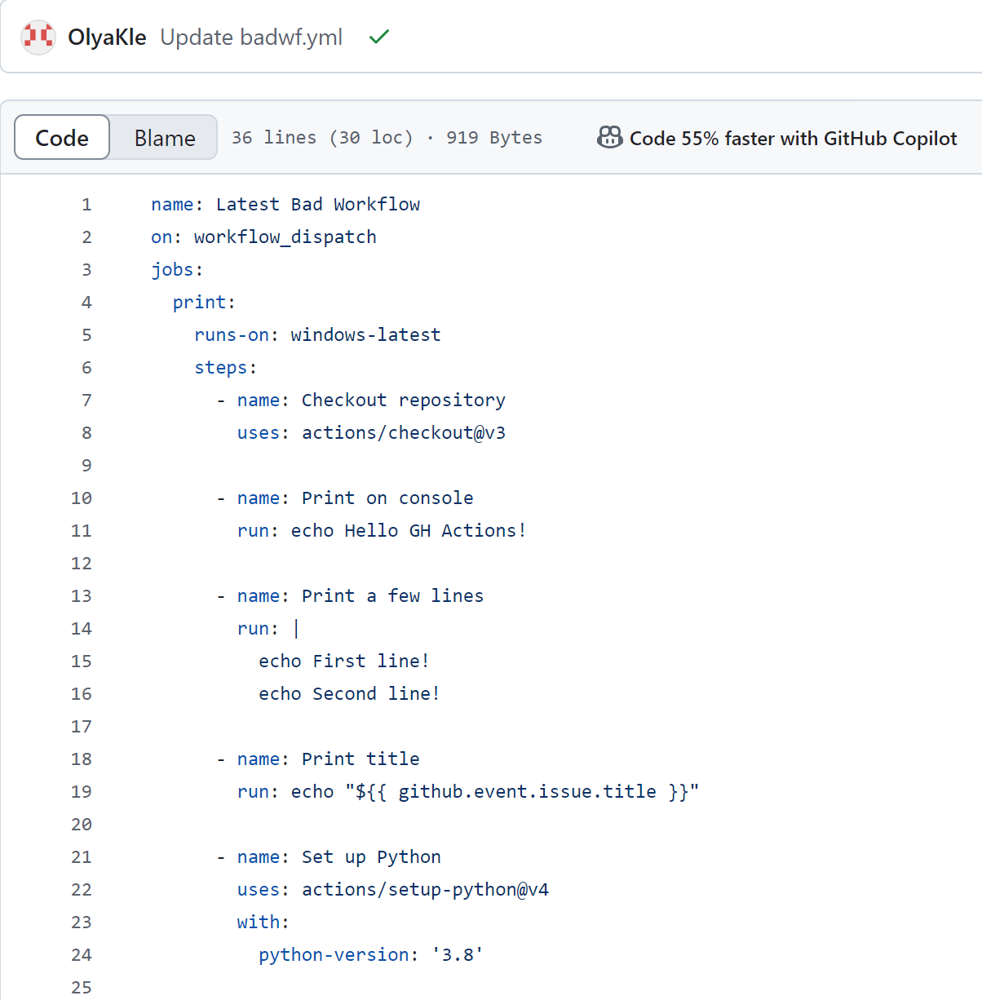
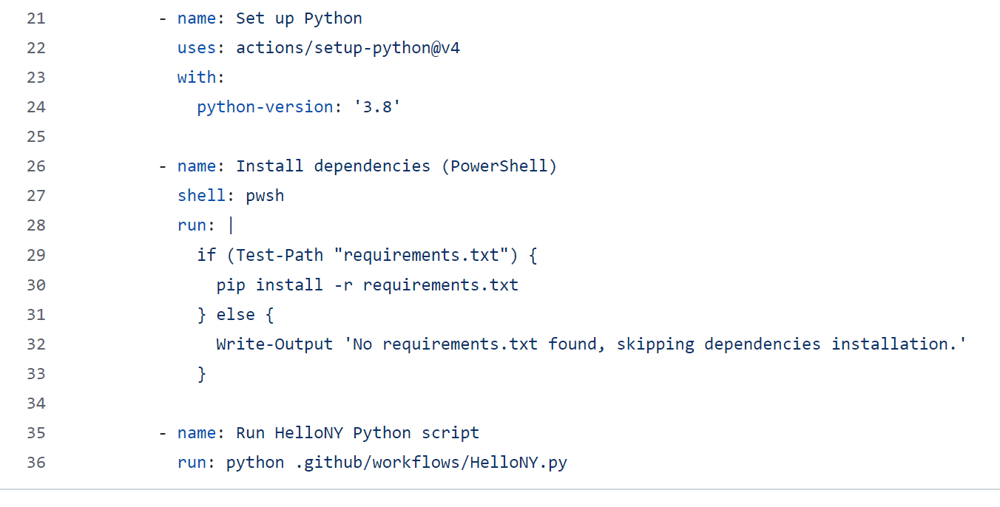

На следующих картинках я снова заглянула  посмотреть результат и в то, как работал воркфлоу:


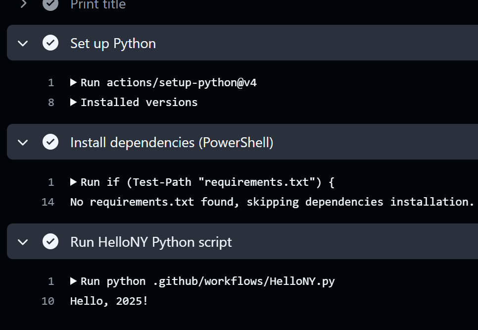

При реализации были "допущены" следующие плохие практики:
- одинаковые названия: в репо - 2 "Bad Workflow"
```
name: Bad Workflow
```
Данная плохая практика возникла в результате нескольких попыток создать работающий "плохой" воркфлоу. Почему плохо?
1. При использовании CI/CD систем, таких как GitHub Actions, одинаковые имена могут привести к конфликтам, особенно если пытаться запускать их одновременно или настраивать триггеры, что будет показано далее.
2. Также документация и комментарии могут стать менее понятными, если воркфлоу имеют одинаковые названия, что затрудняет понимание их назначения и функциональности.
3. Могут возникнуть проблемы с управлением версиями: если использовать одинаковые имена, это может затруднить управление версиями и обновлениями, поскольку не будет ясности, какой воркфлоу нужно обновить или изменить.
- ручной запуск или ручной триггер для развертывания на production
```
on: workflow_dispatch
```
Основные минусы:
1. Может привести к задержкам в процессе развертывания, что противоречит принципам автоматизации (к чему стремится наше общество).
2. Ручной запуск увеличивает вероятность ошибок, таких как запуск неправильного воркфлоу или пропуск необходимых шагов. То есть может привести к непредсказуемым результатам.
3. Некоторые инструменты и системы мониторинга могут не поддерживать ручные триггеры, что может затруднить интеграцию с другими процессами и системами.
4. Если воркфлоу запускается вручную, это может затруднить планирование и координацию между командами, особенно если разные команды используют одни и те же воркфлоу.
- базовая версия - `latest`

  ```
  runs-on: windows-latest
  ```
Это плохая практика, по следующим причинам.
1. Тег 'latest' может создать неожиданные изменения в среде, которые могут нарушить рабочий процесс. 
Например, непредсказуемое поведения при перезапуске - если при создании пода тег latest указывал на версию приложения v1, а через некоторое время у приложения вышла версия v2, то при перезапуске пода на другом узле Kubernetes запустит именно версию v2. При этом новая версия может быть обратно несовместима или содержать ошибки.
2. Невозможно откатиться на предыдущую версию. Если что-то пошло не так, и приложение не запускается или работает с ошибками, то тег latest уже ссылается на новую версию приложения.
- наличие доступа к production у разработчиков
1. Планирование и координация между командами или сотрудниками должны быть четко соблюдены и отслеживаться, во избежание незадокументированных изменений и трудностей в управлении.
2. Разработчики могут непреднамеренно нарушить работу производственных сервисов из-за ошибок в коде или неправильной конфигурации. 
3. Также такой уровень доступа может привести к потере или повреждению данных. Неопытные разработчики могут случайно удалить или изменить критические данные. 
4. Возможны угрозы безопасности. Доступ к производственным системам может открыть уязвимости, которые приведут к утечке чувствительных данных.
- использование синтаксиса `${{}}`
```
run: echo "${{ github.event.issue.title }}"
```
Таким образом синтаксис расширяется, чтобы воспользоваться этим, злоумышленник создал бы проблему с заголовком вроде `$(touch pwned.txt)`.
## Задание 2
> Написать “хороший” CI/CD, в котором исправлены плохие практики из задания 1

Был создан хороший воркфлоу - `goodwf.yml`.

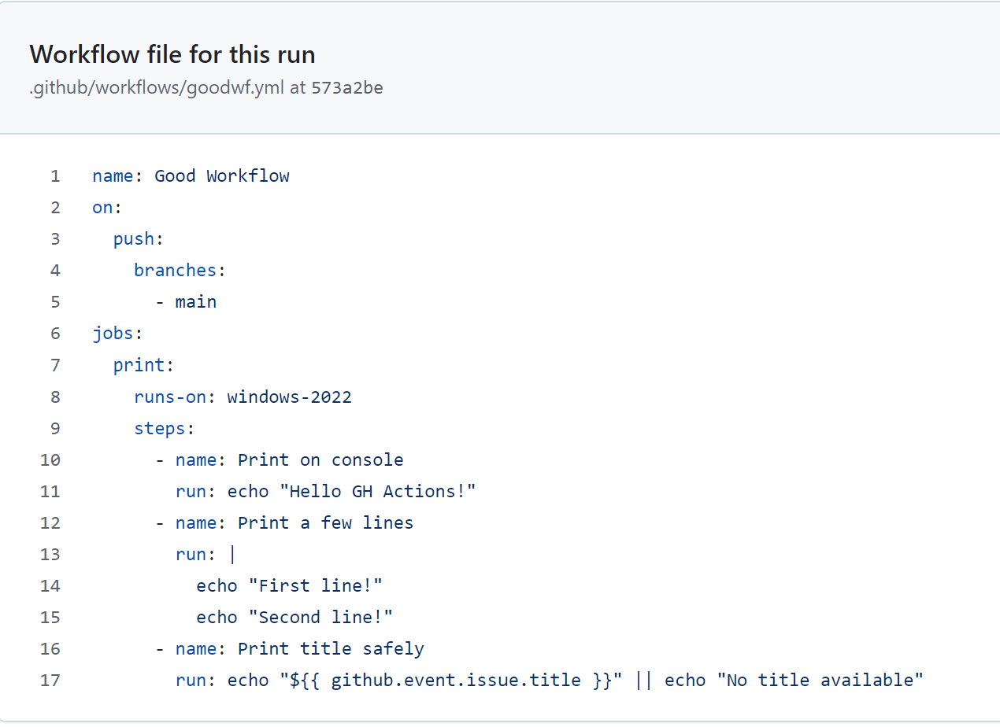

И, конечно, запущен:

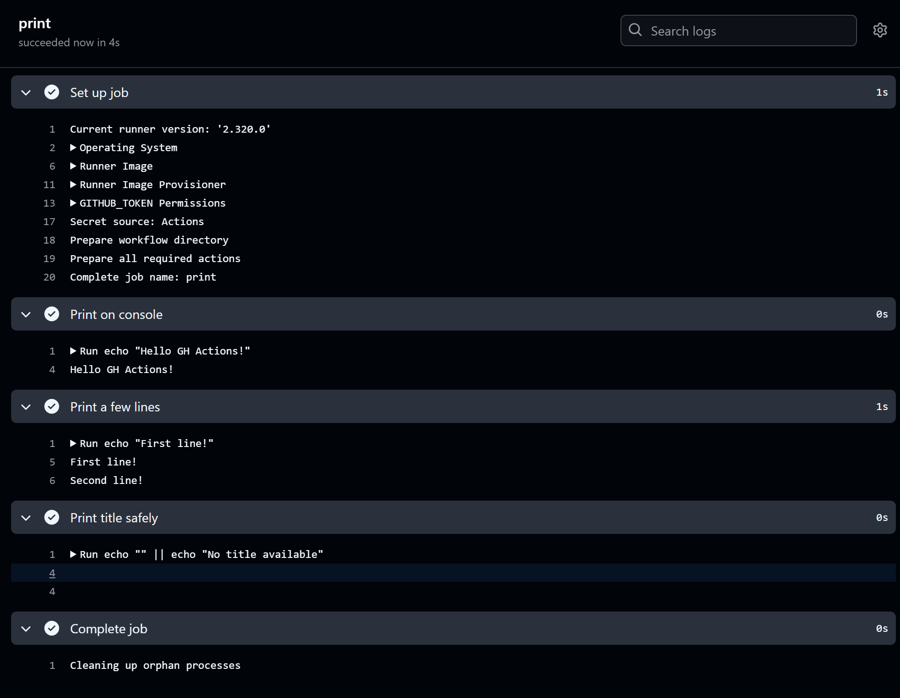

Также добавлена надстройка над питоновским файликом:

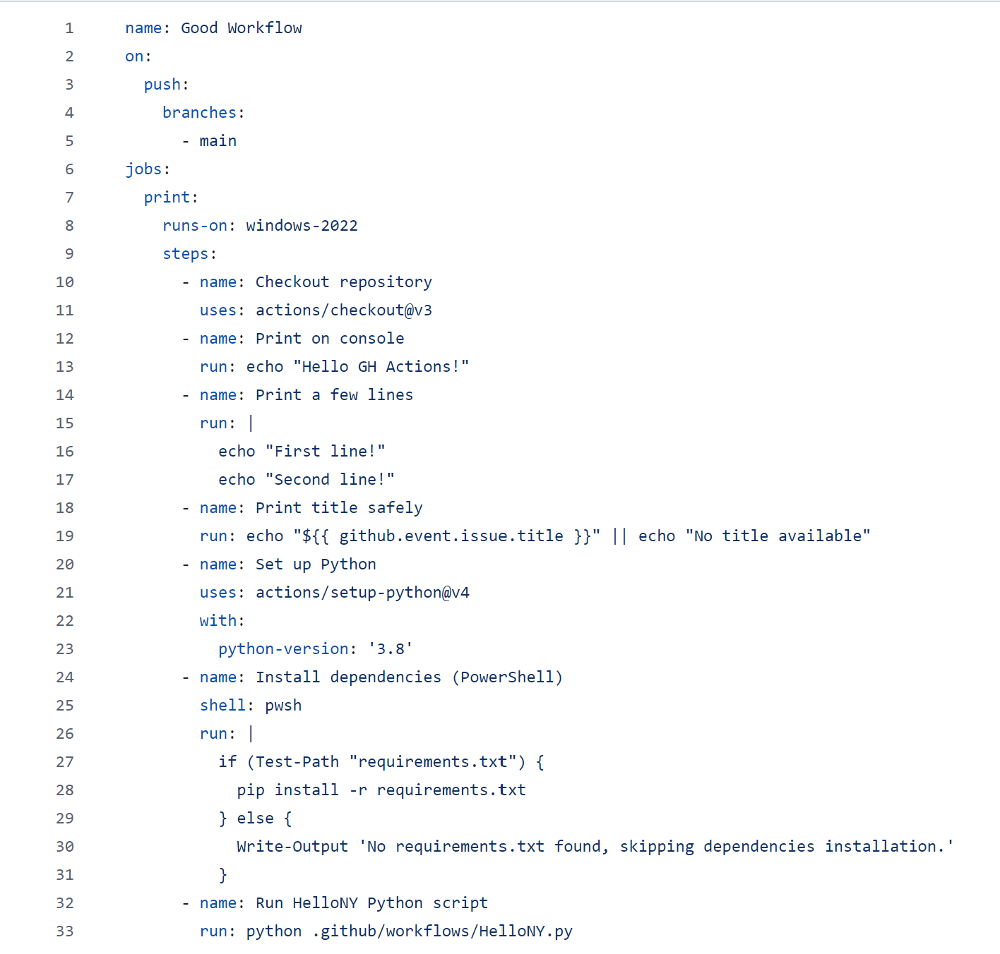

Добавляю результат сборки и работу успешную воркфлоу:

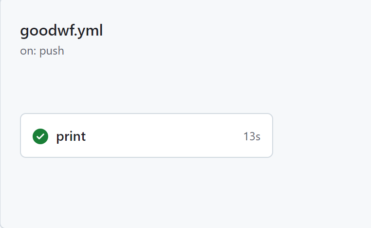
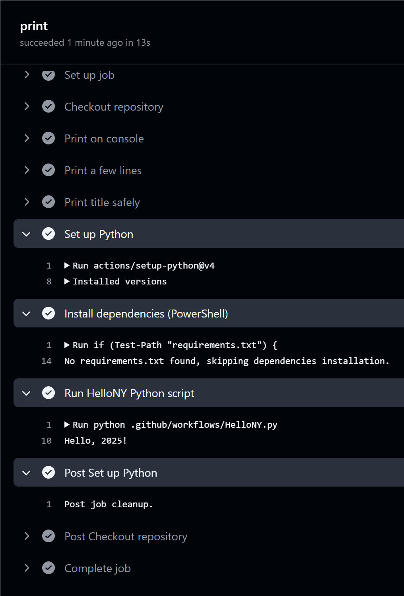

Почему он теперь хороший?
- Изменено имя на `Latest Bad Workflow`, а в новом файле 
совершенно новое - `Good Workflow`.
```
name: Good Workflow
```
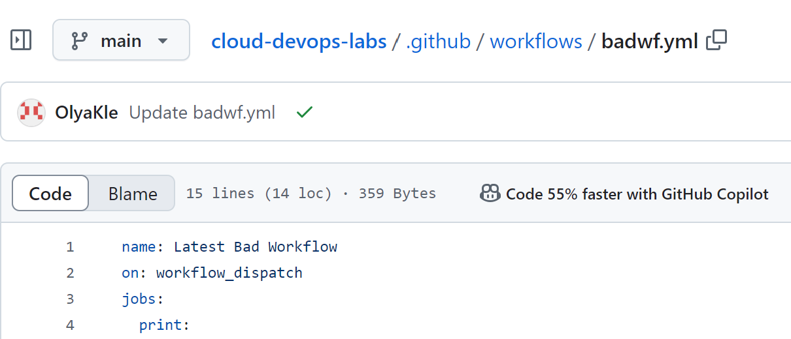

- тег `latest` заменен на последнюю версию `windows-2022` c сайта 
```
https://docs.github.com/en/actions/using-github-hosted-runners/using-github-hosted-runners/about-github-hosted-runners
```
- Изменение триггера с `workflow_dispatch` на `push`.

Триггер `push` обеспечивает автоматическое развертывание при переносе кода в основную ветку. Ко всему прочему это соответствует принципам Continuous Delivery, которые 
автоматизируют процесс развертывания.
- Изменён уровень доступа.

Гарантируя, что только определенные ветки (например, `main`) могут 
инициировать развертывание, уменьшается риск несанкционированного развертывания
изменений на производстве. Эта практика повышает безопасность и контроль над 
процессом развертывания.
```
brunches:
  - main
```
- Использован синтаксис: 
```
run: echo "${{ github.event.issue.title }}" || echo "No title available"
```
То есть шаг печати заголовка был изменен, чтобы включить обратный ход в случае, если 
заголовок недоступен. Это предотвращает потенциальные проблемы, если злоумышленник 
попытается использовать синтаксис ${{ }}. Вместо того чтобы напрямую использовать 
заголовок, он обрабатывается безопасным образом, чтобы избежать риска инъекции 
команд.

## Задание 3 - Также вывод:
> В Readme описать каждую из плохих практик в плохом файле, почему она плохая и как в хорошем она была исправлена, как исправление повлияло на результат.

На предыдущих картинках видно, что `goodwf.yml` собрался и полностью отработал. Из-за того что и `badwf.yml` и `goodwf.yml` очень маленькие файлы разницы во времени сборки почти нет, однако отсутствие необходимости переходить в другую вкладку и в ручную запускать воркфлоу немного экономит время. На этом всё.


