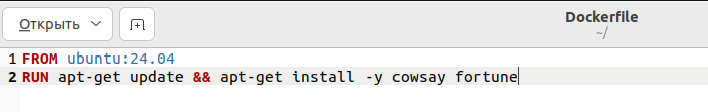

# DevOps-lab2
### Подготовка к выполнению заданий
С помощью команды `touch` создаём файл под названием `Dockerfile`:
```
touch Dockerfile
```
Далее с помощью команды `ls` можно проверить результат:


## Задание 1
> Написать “плохой” Dockerfile, в котором есть не менее трех “bad practices”.

При реализации были "допущены" следующие плохие практики:

- **тег _latest_**
  ```
  FROM ubuntu:latest
  ```
Минус такого тега в том, что при сборке родительский образ может быть заменен новой версией, которая не является обратно совместимой, или может быть получена неправильная "последняя" версия. 

Также тега latest также следует избегать при применении контейнеров в производстве, так как невозможно отследить, какая версия образа выполняется.

- **каждая команда с новой строки**
  ```
  RUN apt-get update
  RUN apt-get install -y cowsay fortune
  ```
Когда мы нагромождаем слоями dockerfile, может повредиться файловая система внутри контейнера. То есть слишком много слоёв могут 
добавить или удалить файл или каталог.

- **загрузка неиспользуемых приложений** - отсуствие экономии места, замедление сборки образа.
```
RUN apt-get -y install libpq-dev imagemagick gsfonts ruby-full
```
Пример такого файла представлен на картинке:


Пример работы с таким докерфайлом представлен на следующих двух картинках:


## Задание 2
> Написать “хороший” Dockerfile.

В исходном "плохом" докерфайле был исправлен тег базового образа с неоднозначного `latest` на `24.04`, то бишь последней версии из онлайн документации установленной версии ubuntu.
```
 FROM ubuntu:24.04
```
Строки с обновлением и установкой необходимых приложений были аккуратно объединены, с использованием разделительного символа `&&`:
```
RUN apt-get update && apt-get install -y cowsay fortune
```
Строка с установкой неиспользующегося приложения была соответственно удалена. Получившийся "хороший" Dockerfile можно у видеть на картинке ниже:



На следующей картинке видно, что работа с приложением происходит корректно.


## Задание 3
> Описать 2 плохих практики по работе с контейнерами.

Плохими практиками при работе с контейнерами считается:
- _хранить данные в контейнерах_

Так как контейнер может быть остановлен или удалён, данные вложенные в него будут
утеряны вместе с ним.
Чтобы избежать утечки данных можно настроить контейнеры так, чтобы данные с них
сохранялись, например, на диск. 

- _использовать sudo при каждой команде_

Её в принципе можно использовать только в крайних случаях, так как она раскрывает слишком много доступа, и для этого стоит проверить доступ к контейнеру, и если его нет, то настроить, следующими командами:
```
groups
```
Таким образом мы проверим существующие группы,
```
sudo groupadd docker
```
Этой командой можно создать группу, если её ещё не существует,
```
sudo usermod -aG docker olya
```
Теперь изменён доступ юзера `olya` к докерфайлу,
```
newgrp docker
```
А последней командой мы переключились на новую группу, в которой юзер точно состоит. Результат на фото.


