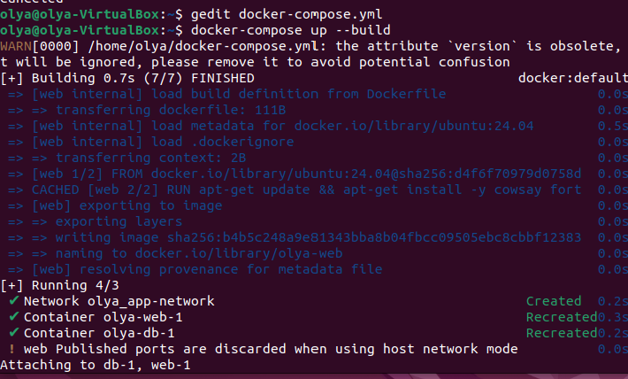

# DevOps-lab 2*:
Перед началом работы нудно разобраться в чем отличие Docker-Compose от Docker.

Docker-Compose — это инструмент для определения и запуска многоконтейнерных Docker 
приложений. С помощью простого YAML-файла можно настроить все необходимые сервисы 
приложения и запустить их одной командой. Это значительно упрощает процесс 
разработки, тестирования и развертывания приложений, состоящих из множества 
контейнеров.

Отличие Docker-Compose от Docker заключается в уровне абстракции и цели 
использования:
- Docker фокусируется на создании, запуске и управлении отдельными контейнерами. 
Он предоставляет базовые инструменты и API для работы с контейнерами, образами и 
хранилищами данных.
- Docker-Compose предназначен для автоматического размещения, координации и управления многоконтейнерных приложений, 
позволяя управлять комплексными приложениями, состоящими из множества 
взаимосвязанных контейнеров, как единым целым.

### Подготовка
Установка Docker-Compose:
С помощью следующих двух команд установленные пакеты обновятся до последней версии:
```
sudo apt update -y
sudo apt upgrade -y
```
Затем с помощью команды ниже можно проверить установлен ли docker и  до какой 
версии обновлен:
```
docker -v
```


Так как докер установлен, можно установить docker-compose:
```
sudo curl -L "https://github.com/docker/compose/releases/latest/download/docker-compose-$(uname -s)-$(uname -m)" -o /usr/local/bin/docker-compose
```


Сделать команды докер доступными без команды `sudo` можно следующим способом:
```
sudo chmod +x /usr/local/bin/docker-compose
```


Далее модно проверить версию установленного докер-копмоза:
```
docker-compose version
```


## Задание 1: 
> Написать “плохой” Docker compose файл, в котором есть не менее трех “bad practices” по их написанию.

Задание было выполнено по следующим шагам:
1. Создан файл `docker-compose.yml` с помощью команды `touch`;

2. Через команду `gedit <file>` в редакторе написанискомый "плохой" файл:
   


3. С помощью команды, написанной ниже, получившееся приложении "забилдено" или собрано:
```
docker-compose up --build
```


В первой строке `docker-compose.yml` указана версия Docker Compose, взятая за основу приложения;
```
version: '3'
```
Далее основной раздел, определяющий контейнеры (`services`), которые должны быть запущены в рамках приложения. Каждый сервис может использовать образ Docker, 
собранный из Dockerfile, или готовый образ из Docker Hub.
```
services:
  web:
    build: .
    ports:
      - "5000:5000"
    volumes:
      - .:/code
    depends_on:
      -db
    environment:
      -DEBUG=true
    network_mode: host
    privileged: true
    restart: always
```
Сервис `build` указывает на директорию с Dockerfile, из которого будет собран образ для сервиса;

`ports` - cписок портов для публикации из контейнера на хост-машину, обычно в формате "HOST:CONTAINER";

`volumes` - позволяет монтировать тома для хранения данных за пределами жизненного цикла контейнера, что полезно для 
сохранения данных при перезапуске и обновлении контейнеров;

`depends_on` - указывает на зависимости между сервисами, гарантируя, что сервисы запускаются в определенном порядке.

`environment` - определяет переменные окружения, которые должны быть установлены в контейнере при его запуске;

`network_mode` - настройка сетей, к которым будут подключены вышеописанные сервисы;
    
`privileged` - права доступа, которыми будет обладать приложение и те, кто с ним работает;
    
`restart` - перезапуск приложения, добавляется как дополнительный параметр в чаастных ситуациях.

Плохие практики:
1. Передача чувствительной информации или режима отладки через переменные 
окружения в production
```
volumes:
      - .:/code
...
 environment:
      - DEBUG=true 
``` 
Включение отладки через переменную окружения в production-контейнерах может отдать
больше информации в открытый доступ.

2. Запуск контейнера с повышенными привилегиями
```
privileged: true
```
Установка такого статуса даёт контейнеру доступ ко всему хосту, опять же создавая
уязвимую ситуацию.

3. Настройка рестарта "always" без мониторинга состояния приложения
```
restart: always
```
Такой параметр осуществляет перезапусак без мониторинга сосотояния приложения 
при наличии ошибки, вызвавшей остановку работы контейнера, но если ошибка в
установленной конфигурации, этот параметр может начать бескоенчно перезапускать 
контейнер, без устранения ошибки. 

## Задание 2:
> Написать “хороший” Docker compose файл, в котором эти плохие практики исправлены.

Файл исправлен через команду `gedit` в редакторе:


Приложение собралось:


Исправленые плохие, а теперь хорошие практики:
1. Использование безопасных переменных окружения для определения среды
```
 environment:
      - APP_ENV=production 
``` 
При замене переменной `DEBUG=true` на `APP_ENV=production` передается только
необходимая информация, при этом остальная информация передаётся только в режиме 
чтения, с помощью следующих строк.
```
volumes:
      - .:/code:ro 
```
2. Отключение повышения привилегий
```
security_opt:
      - no-new-privileges:true 
```
Вместо запуска контейнера с привелегиями используется опция, которая обеспечивает
контейнеру возможность повысить свои привелегии, повышая и его безопасность.
3. Перезапуск только при ошибках приложения
```
restart: on-failure
``` 
Благодаря такому тегу приложение будет перезапускать только при внутренних ошибках,
не доводя до циклических перехапусков.

## Задание 3: 
> В Readme описать каждую из плохих практик в плохом файле, почему она плохая и как в хорошем она была исправлена, как
исправление повлияло на результат.

Сделано!

## Задание 4:
> настроить сервисы так, чтобы контейнеры в рамках этого compose-проекта так же поднимались вместе, но не "видели"
друг друга по сети.

Такая настройка позволит создать изолированные сегменты сети, что повысит безопасность и 
упростит коммуникацию между определёнными группами контейнеров. Для подключения 
сервисов к сетям нужно указать сети в разделе networks для каждого сервиса.

Настройка пользовательской сети:
```
networks:
      - app-network
```
Вместо сети хоста создаётся отдельная для изоляции контейнеров.

Почему не так плохо?
Использование сети хоста:
```
network_mode: host 
```
Такой контейнер получает полный доступ к сети хоста, что может привести к атакам,
создавая угрозу безопасности. 

Если исправить попробовать построить файл с новымии настройками:


Всё получилось.
